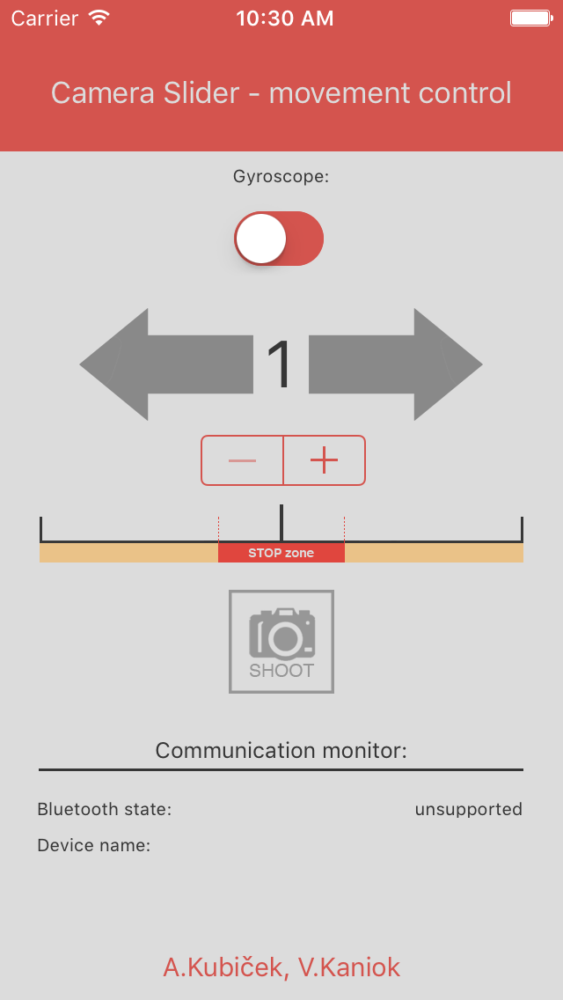

# CameraSlider-GyroControl
Application (iOS) to control the camera slider. Stepper motor is controlled by tilting the phone on the side, data is sent to the controller using Bluetooth 4.0. Developed as part of the local competition project in 2015.

### iOS application:
- Control direction and speed (left/right)
  - Manual buttons
  - Gyroscope (phone tilting)
- Control the camera (manul shoot button)
- Bluetooth 4.0 communication with Arduino controller

&nbsp;

  

